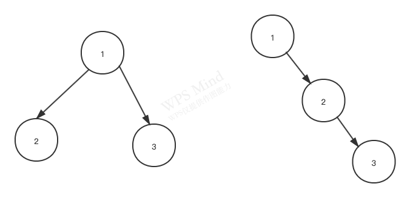

### 学到一些平时没注意的细节：

1. 遇到问题习惯使用中文搜索，改成英文使用google会好很多

2. 查某个问题看高赞回答，并且多看几个不同的回答；

比如理解递归：
这么查
how to understand recursion

<https://stackoverflow.com/questions/717725/understanding-recursion>

比如两个for循环和一个for循环解决同一问题的区别？
这么查
one for loop vs two for loop

### N皇后问题

- backtracking，回溯是递归的一种，二叉树的dfs就是回溯
  举例：
  如果对二叉树的dfs加一些条件，比如：父节点是坏的，那么子节点就是坏的，需要从树中找出好的叶子节点；当遍历达到某个坏的节点时，返回上一层，遍历另一个节点继续寻找，知道结束。这就是回溯，递归的一种

- 回溯的理解很简单，加上细节会变得复杂，N皇后加了两个条件：
1.皇后横竖斜限制
2.数据结构是矩阵

参考：https://www.cis.upenn.edu/~matuszek/cit594-2012/Pages/backtracking.html

### 二叉树的最近公共祖先问题：对最后终止条件的说明

```
func lowestCommonAncestor(root, p, q *TreeNode) *TreeNode {
	if root == nil {
		return nil
	}
	if p == root || q == root {
		return root
	}
	left := lowestCommonAncestor(root.Left, p, q)
	right := lowestCommonAncestor(root.Right, p, q)
	if left != nil && right != nil {
		return root
	}
	if left == nil{
		return right
	}
	if right == nil{
		return left
	}
	return nil
}
```





- 举例：两棵树，左边这个如果查找2，3，root左右不为nil，返回root；右边这个如果查找2，3，left是nil，跳到了right，查找其子树，返回，其返回被当作最开始的left的返回值，用来判断left，right ！= nil


- 组合
组合解法中出现golang slice应用出错问题，需注意